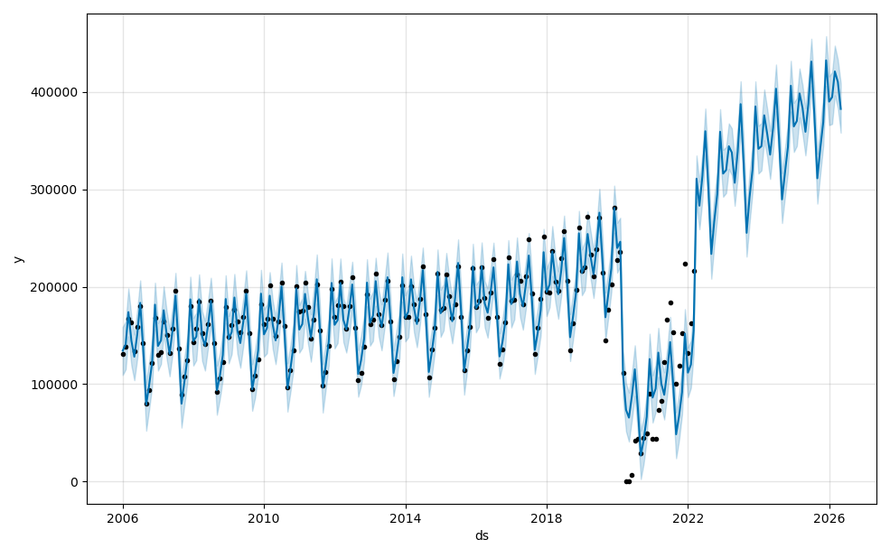
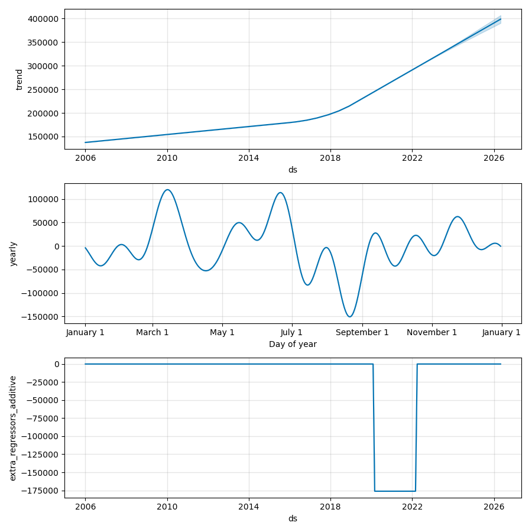
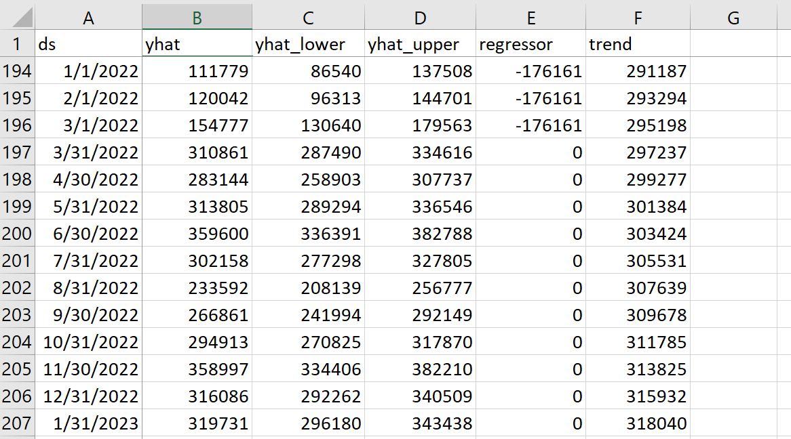
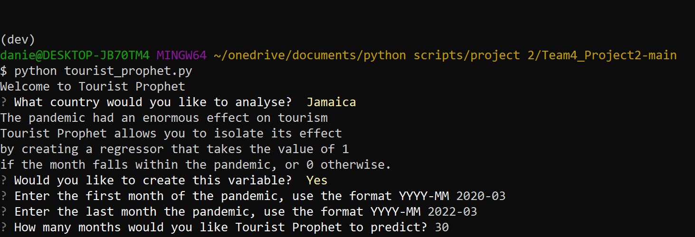

# Tourist Prophet
<p align='center'> </p>

## A Disrupted Industry

The pandemic was a very difficult time for the tourism industry. Tourist Prophet allows the user to access monthly historical data on the number of tourist visitors to a country and make a forecast using [Facebook’s Prophet](https://pypi.org/project/fbprophet/). 

---

## Installation
### Libraries
[SQLAlchemy](https://www.sqlalchemy.org/) - An open-source [Python](https://www.python.org/) SQL toolkit which helps to convert data and interact between databases.

[Pandas](https://pandas.pydata.org/) - For data analysis and manipulation.

[Facebook’s Prophet](https://pypi.org/project/fbprophet/) - Enable forecasting including uncertainty levels.

[Questionary](https://pypi.org/project/questionary/) - Builds command line interface to interact and query the user.

[Matplotlib](https://matplotlib.org/) - Creates static, animated or/and interactive visualizations.

---

### *Requirements*

The user needs to have Facebook's Prophet installed in their environment. They can get it by running this code:
```
>conda install plotly
>conda install -c conda-forge fbprophet
```
---

## Usage
Tourist Prophet is a Python app that needs to run on terminal. You will also need the SQL database called [tourism_data](https://github.com/TheoG2022/Team4_Project2/blob/main/Resources/tourism_data.db). 

The user can select one out of five countries:
[Iceland](https://www.ferdamalastofa.is/en/recearch-and-statistics/numbers-of-foreign-visitors), [Jamaica](https://tourismanalytics.com/jamaica.html), [Portugal](https://tradingeconomics.com/portugal/tourist-arrivals), [Singapore](https://stan.stb.gov.sg/public/sense/app/877a079c-e05f-4871-8d87-8e6cc1963b02/sheet/3df3802e-2e5b-4c79-950d-d7265c4c07a9/state/analysis), [UK](https://data.worldbank.org/indicator/ST.INT.RCPT.CD?locations=GB)

*The available historical data varies by country, the model in Tourist Prophet will use all available data.*

### Steps

1.  Select a country - The app will give you options from the list of countries in the SQL database
2.  Create a variable - The app will ask whether the user wants to create a dummy variable for the pandemic. The dummy will take the value of 1 if the month falls within the pandemic and 0 otherwise. If the user decides to create the variable it will then ask to specify the first and last month of the pandemic.
3.  Specify period to forecast - The user can specify the number of months they want to forecast. We think that about 50 months in the future is a fair forecast given available data, however, the user can enter any number. If the number is too large (~10,000) the program will not run. Typically, the forecast should be at most half the period on available data.
4.  The program will produce four graphs and save a file called 'forecast.csv' in the folder where the app is located.

<p align='center'> </p>
The black dots represent real data. The blue line the forecast made by Tourist Prophet. The blue shaded area is the 95% confidence interval. 

<br>
<br>
<br>


<p align='center'> </p>
The top graph shows the trend. The graph in the middle the annual seasonality. The bottom graph the coefficient of the dummy variable. 

<br>
<br>
<br>
<p align='center'> </p>
This an image of 'forecast.csv'. what is the predicted number of visitors that month. 

<br>

---

## Command Line Interface
<p align='center'> </p>
This is the command Line interface of how the app looks and interacts.

---

## Contributors
[Chukwuma Ochu](https://github.com/Chukwuma), [Daniel Pulido-Mendez](https://github.com/daniel-lobster), [Dynah Beermann](https://github.com/DynahB1), [Theo Gill](https://github.com/TheoG2022), [Tiago Lopez](http://github.com/tiagonlopes)

---

## License
MIT
